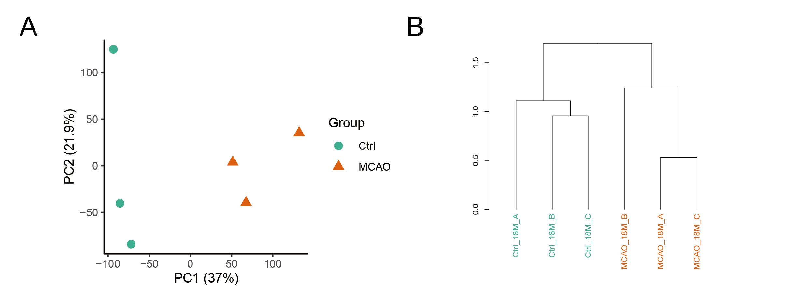
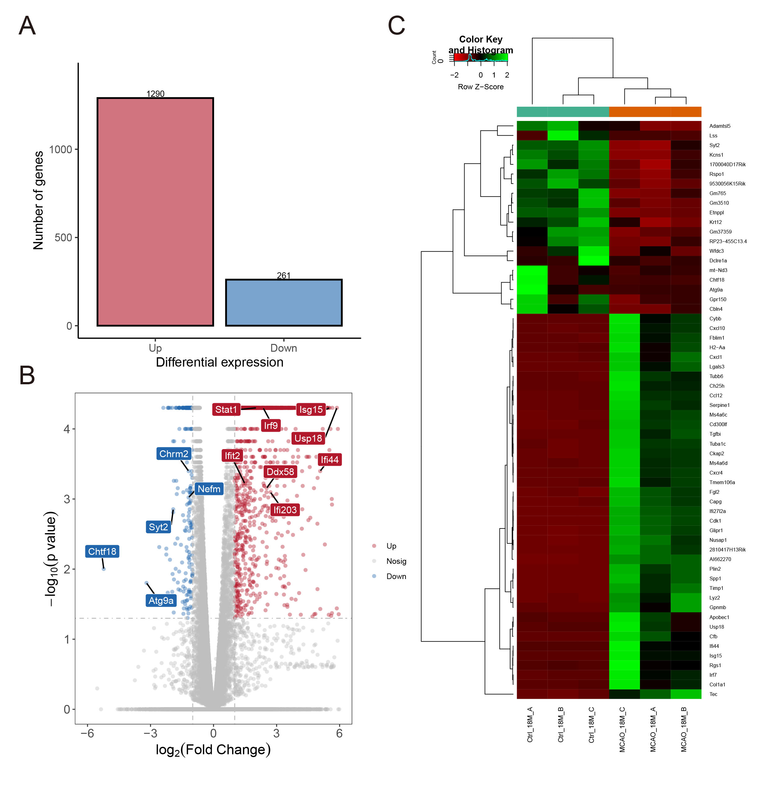
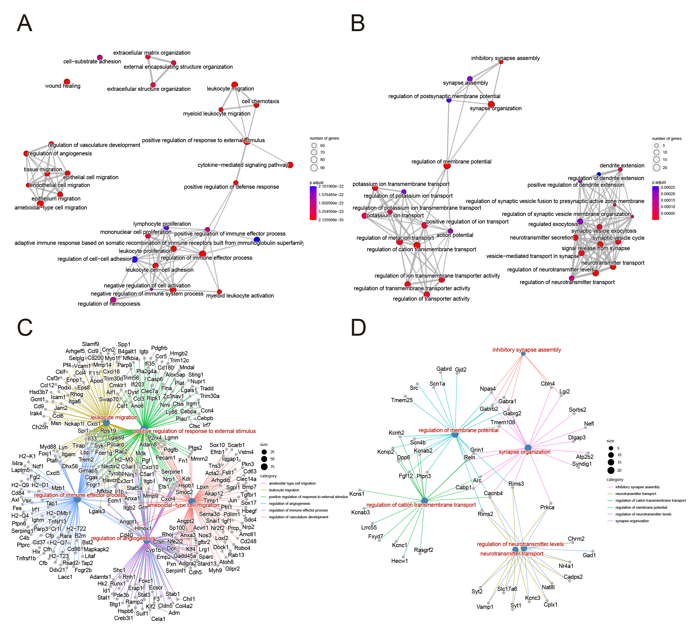

RNA-seq Analysis of Ischemic Stroke in Aged Mouse Brain
================

- <a href="#abstract" id="toc-abstract">1 Abstract</a>
- <a href="#introduction" id="toc-introduction">2 Introduction</a>
- <a href="#methods" id="toc-methods">3 Methods</a>
  - <a href="#data-source" id="toc-data-source">3.1 Data Source</a>
  - <a href="#rna-seq-data-analysis" id="toc-rna-seq-data-analysis">3.2 RNA-seq data analysis</a>
  - <a href="#code-availability" id="toc-code-availability">3.3 Code availability</a>
- <a href="#results" id="toc-results">4 Results</a>
  - <a
    href="#the-data-of-ischemic-mice-and-normal-mice-can-be-distinguished"
    id="toc-the-data-of-ischemic-mice-and-normal-mice-can-be-distinguished">4.1 The data of ischemic mice and
    normal mice can be distinguished</a>
  - <a href="#ischemic-aged-mice-have-a-large-number-of-upregulated-genes"
    id="toc-ischemic-aged-mice-have-a-large-number-of-upregulated-genes">4.2 Ischemic aged mice have a large
    number of upregulated genes</a>
  - <a
    href="#ischemic-stroke-is-accompanied-with-increased-neuroinflammation-and-decreased-neurotransmitter-transport"
    id="toc-ischemic-stroke-is-accompanied-with-increased-neuroinflammation-and-decreased-neurotransmitter-transport">4.3 Ischemic stroke is accompanied
    with increased neuroinflammation and decreased neurotransmitter
    transport</a>
- <a href="#discussion" id="toc-discussion">5 Discussion</a>
- <a href="#bibliography" id="toc-bibliography">References</a>

# Abstract

An ischemic stroke occurs when the blood supply to part of the brain is
interrupted or reduced, preventing brain tissue from getting oxygen and
nutrients, yet it is unclear what are the underlying mechanisms at the
transcriptome level. To solve this problem, I perfom a RNA-seq analysis
of ischemic stroke in aged (18-month-old) mouse brain, whose data were
collected from the public database. Through assessing differential gene
expression across injury status, it was found that downregulation of
neurotransmitter transport and synaptic plasticity, with upregulation of
inflammatory cascade response in aged post-stroke, which may provide new
insights into the transcriptional response to ischemic stroke.

# Introduction

Stroke, also known as cerebralvascular acident (CVA), is a serious
neurological disease that can lead to severe disability and death.
Stroke is the second leading cause of death in the world after ischemic
heart disease, and has become the leading cause of death in
China\[[1](#ref-Liping2011Stroke)\]. The onset of stroke can
be divided into two categories: ischemic stroke and hemorrhagic stroke.
Ischemic stroke, which is the most common type of stroke, is caused by
insufficient blood supply to the
brain\[[2](#ref-2015Endovascular)\].

In this study, I aimed to explore the impact of ischemic stroke at the
transcriptome level, trying to decode the transcriptional response to
ischemic stroke in aged mouse brain.

# Methods

## Data Source

Data for this study were obtained from the paper, Decoding the
Transcriptional Response to Ischemic Stroke in Young and Aged Mouse
Brain, published by Androvic et al. in Cell Reports in June 2020, which
can be accessible through GEO series accession number
[GSE137482](https://www.ncbi.nlm.nih.gov/geo/query/acc.cgi?acc=GSE137482).
3 and 18 month-old C57Black/6 female mice were subjected to permanent
middle cerebral artery occlusion (MCAO) to model cerebral ischemia.
Parietal cortex tissue was collected 3 days after MCAO and total RNA was
isolated using TRIZOL. Intact 3 and 18-month old female mice were used
as controls. I selected six samples from the original data, three
experimental and three control sample respectively (
[Table 1](#tbl-samples)).

|     RUN     |   Sample   | Group |
|:-----------:|:----------:|:-----:|
| SRR10123774 | Ctrl_18M_A | Ctrl  |
| SRR10123775 | Ctrl_18M_B | Ctrl  |
| SRR10123776 | Ctrl_18M_C | Ctrl  |
| SRR10123786 | MCAO_18M_A | MCAO  |
| SRR10123787 | MCAO_18M_B | MCAO  |
| SRR10123788 | MCAO_18M_C | MCAO  |

Table 1: **Selected raw data for RNA-seq analysis**

## RNA-seq data analysis

Raw RNA-Seq data from the SRA was dowloaded with *fastq-dump*
v2.11.0\[[3](#ref-2010sra)\]. Adaptor sequences and low
quality reads were removed using *Trim Galore*
v0.6.7\[[4](#ref-felix_krueger_2021_5127899)\]. The remaining
reads were aligned to GRCm38 using *Tophat* v2.1.1 with default
parameters\[[5](#ref-kimTopHat2AccurateAlignment2013)\].
Mapped reads were counted over Gencode vM8 gene annotation using
*Cufflinks*
v2.2.1\[[6](#ref-trapnellTranscriptAssemblyQuantification2010)\].
The RPKM (Reads Per Kilobase of transcript per Million reads mapped)
values were normalized to TPM (Transcripts Per Kilobase Million) using
the script, *FPKM2TPM.R*, to allow the comparison of gene expression
between samples. The program *cuffdiff* with default parameters in the
*Cufflinks* suite was used to calculate the fold-change and P-value of
genes for comparison between
samples\[[6](#ref-trapnellTranscriptAssemblyQuantification2010)\].
Three biological replicates for MAO mice and normal aged mice were
investigated to identify differentially expressed genes at the cut-off
of \|log2FC\>1\| and P-value \<0.05. Utilizing the built-in R (v4.2.2)
functions *prcomp* and *hclust* to perform Principal Component Analysis
(PCA) and hierarchical clustering analysis. The R package from
Bioconductor, *clusterProfiler* (v4.6.0) was used to perform GO term and
KEGG pathway enrichment analysis for differential gene
expression\[[7](#ref-yuClusterProfilerPackageComparing2012)\].

## Code availability

All the shell-scripts and R-scripts used to perform data processing and
analysis are deposited to the GitHub repository website
(<https://github.com/Achuan-2/rna-seq-practice>).

# Results

## The data of ischemic mice and normal mice can be distinguished

To provide an overview of the data, Principal Component Analysis (PCA)
and hierarchical clustering analysis were performed. As can be seen in
[Figure 1](#fig-overview), the distances between groups were closer and
the overall gene expression of the MAO (middle cerebral artery
occlusion) group could be distinguished from those of control group.

<figure>

<figcaption aria-hidden="true">Figure 1: <strong>Data Overview</strong>.
<strong>(A)</strong> PCA plot showing global similarity of genes
expression in control and MCAO samples. <strong>(B)</strong> Cluster
Dendrogram based on Pearson distance showing similarity among control
and MCAO samples.</figcaption>
</figure>

## Ischemic aged mice have a large number of upregulated genes

As is shown in [Figure 2](#fig-differential), after differential gene
expression analysis of genes between groups, 1,551 differential genes
were found in MAO mice compared to control mice (\|log2FC\|\>1; p-value
\< 0.05). Moreover, the number of up-regulated genes was significantly
higher than that of down-regulated genes (up-regulated: log2FC\>1,
down-regulated: log2FC\<-1).

<figure>

<figcaption aria-hidden="true">Figure 2: <strong>Differential Gene
Expression Analysis</strong>. <strong>(A)</strong> Differences in the
number of up-regulated and down-regulated genes between MAO and control
mice (up-regulated: log2FC&gt;1, down-regulated: log2FC&lt;-1).
<strong>(B)</strong> Volcano plots showing differential gene expression
between MAO and control mice. <strong>(C)</strong> Heatmap showing
significantly differentially expressed genes between MAO and control
mice (|log2FC|&gt;1; p-value &lt;0.05).</figcaption>
</figure>

## Ischemic stroke is accompanied with increased neuroinflammation and decreased neurotransmitter transport

Through Gene Ontology (GO) enrichment analysis of up-regulated genes and
down-regulated genes respectively, it was found that the GO Term of the
up-regulated genes is significantly enriched in inflammatory response
(such as regulation of immune effector process, leucocyte promotion,
mononuclear cell promotion, myeloid leucocyte activation), cell-cell
interactions (such as extraceller matrix organization, extraceller
structure organization, cell subtract adhesion), cell migration (such as
leukocyte migration, ameboidal type cell migration). On the other hand,
gene associated with neurotransmitter transport and potassium ion
channels et al., were downregulated ([Figure 3](#fig-go)).

<figure>

<figcaption aria-hidden="true">Figure 3: <strong>Gene Ontology
Enrichment Analysis</strong>. <strong>(A)</strong> Enrichment Map for
enrichment result of up-regulated genes in MAO mice.
<strong>(B)</strong> Enrichment Map for enrichment result of
down-regulated genes in MAO mice. <strong>(C)</strong> Gene-Category
Network for enrichment result of up-regulated genes in MAO mice. Only
the top 5 categories order by gene ratio are displayed.
<strong>(D)</strong> Gene-Category Network for enrichment result of
down-regulated genes in MAO mice. Only the top 5 categories order by
gene ratio are displayed.</figcaption>
</figure>

# Discussion

In this study, transcriptome analysis was carried out in aged
post-stroke mice and normal mice. The results showed that the
up-regulated genes in stroke mice focused on inflammatory cascade and
peripheral leukocyte proliferation, which are the strongest producers of
reactive oxygen species (ROS) and matrix metallopeptidases (MMPs) and
promote neuronal injury and BBB
disruption\[[8](#ref-allenOxidativeStressIts2009),[9](#ref-streckerNeutrophilGranulocytesCerebral2017)\].
The down-regulated genes may be related to neurotransmitter transport
and synaptic plasticity. Analysis results suggest that an increased
neuroinflammation and infiltration of circulating immune cells may be
one of the primary drivers for the exacerbated pathology in aged
post-stroke mice.

In conclusion, detailed insights into transcriptional response to stroke
described in this study may contribute to our understanding of the
interplay between stroke pathology and aging, and open avenues for the
future search for effective therapeutic approaches.

In addition, limited to time and server storage space, in terms of data,
only the aged samples were analyzed, whereas the young samples were
ignored. In terms of data analysis, Gene Set Enrichment Analysis (GSEA)
and Gene Co-expression Network Analysis (WGCNA) has not been conducted.
I hope there will be time to further study and improve the analysis
ability of bioinfomatics in the future.

# References

\[1\] Liu L, Wang D, Wong K S L, et al. [Stroke and
stroke care in China: Huge burden, significant workload, and a national
priority](https://doi.org/10.1161/STROKEAHA.111.635755)\[J\]. Stroke,
2011, 42(12): 3651-3654.

\[2\] Sardar P, Chatterjee S, Giri J, et al.
[Endovascular therapy for acute ischaemic stroke: A systematic review
and meta-analysis of randomized
trials](https://doi.org/10.1093/eurheartj/ehv270)\[J\]. European Heart
Journal, 2015, 36(35): 2373-2380.

\[3\] Leinonen R, Sugawara H, Shumway M, et al. [The
sequence read archive](https://doi.org/10.1093/nar/gkq1019)\[J\].
Nucleic Acids Research, 2011, 39: D19-21.

\[4\] Krueger F, James F, Ewels P, et al.
[FelixKrueger/TrimGalore: v0.6.7 - DOI via
zenodo](https://doi.org/10.5281/zenodo.5127899)\[M\]. Zenodo,
2021.

\[5\] Kim D, Pertea G, Trapnell C, et al. [TopHat2:
Accurate alignment of transcriptomes in the presence of insertions,
deletions and gene
fusions](https://doi.org/10.1186/gb-2013-14-4-r36)\[J\]. Genome Biology,
2013, 14(4): R36.

\[6\] Trapnell C, Williams B A, Pertea G, et al.
[Transcript assembly and quantification by RNA-seq reveals unannotated transcripts and
isoform switching during cell
differentiation](https://doi.org/10.1038/nbt.1621)\[J\]. Nature
Biotechnology, 2010, 28(5): 511-515.

\[7\] Yu G, Wang L G, Han Y, et al. [clusterProfiler: An R package for comparing
biological themes among gene
clusters](https://doi.org/10.1089/omi.2011.0118)\[J\]. Omics: A Journal
of Integrative Biology, 2012, 16(5): 284-287.

\[8\] Allen C L, Bayraktutan U. [Oxidative stress and
its role in the pathogenesis of ischaemic
stroke](https://doi.org/10.1111/j.1747-4949.2009.00387.x)\[J\].
International Journal of Stroke: Official Journal of the International
Stroke Society, 2009, 4(6): 461-470.

\[9\] Strecker J K, Schmidt A, Schäbitz W R, et al.
[Neutrophil granulocytes in cerebral ischemia - Evolution from killers
to key players](https://doi.org/10.1016/j.neuint.2016.11.006)\[J\].
Neurochemistry International, 2017, 107: 117-126.

